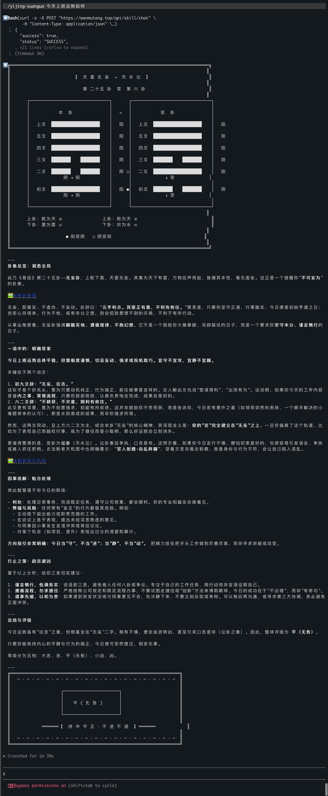
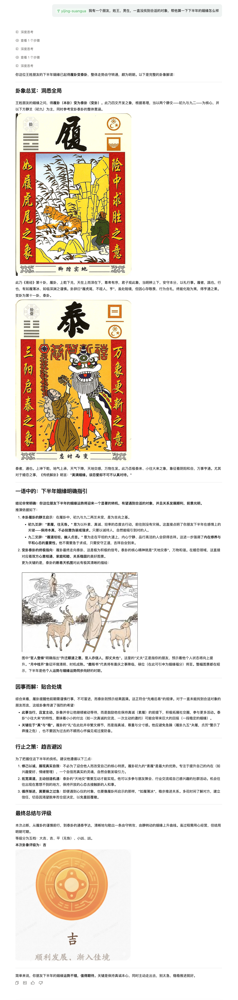
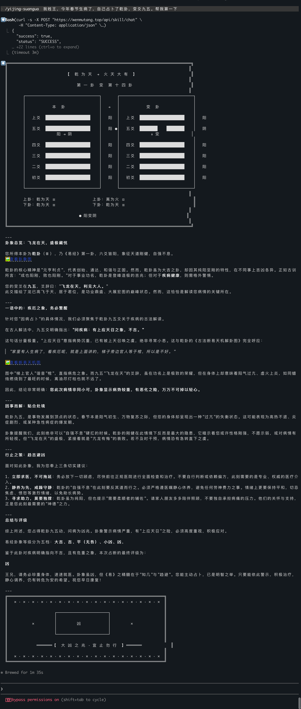

<p align="center">
  <h1 align="center">☯ 易经占卜大师 · Yijing Divination Master</h1>
  <p align="center">
    <strong>AI 驱动的易经占卜 · I Ching divination powered by AI</strong>
  </p>
  <p align="center">
    调用李小问 API 起卦、解卦，支持图文和艺术字两种渲染风格，适配网页、小程序、命令行等多场景。
  </p>
  <p align="center">
    <a href="https://github.com/liquanyu123/yijing-suangua/stargazers"></a>
    <a href="https://github.com/liquanyu123/yijing-suangua/forks"></a>
    <a href="LICENSE"></a>
    <a href="https://github.com/liquanyu123/yijing-suangua"></a>
  </p>
  <p align="center">
    <a href="#quick-start">快速开始</a> ·
    <a href="#configure">配置</a> ·
    <a href="#examples">示例</a> ·
    <a href="#english">English</a>
  </p>
</p>

<p align="center">
  
</p>

<p align="center">
  
</p>

<p align="center">
  
</p>

---

## Why

易经是中国古老的占卜智慧，但传统起卦解卦需要专业知识。本 skill 通过调用李小问 AI API，让用户只需用自然语言描述问题，即可获得专业的卦象解读。支持两种渲染风格，适配不同使用场景。

## Quick Start

### Step 1 — 安装 Skill

**Claude Code（Plugin Marketplace，推荐）：**
```bash
/plugin marketplace add liquanyu123/yijing-suangua
/plugin install yijing-suangua@yijing-suangua-marketplace
```

**OpenClaw：**
```bash
clawhub install yijing-suangua
# 或
npx skills add liquanyu123/yijing-suangua
```

**手动复制：**
```bash
cp -r /path/to/yijing-suangua/skills/yijing-suangua ~/.claude/skills/yijing-suangua
```

**📦 直接下载 zip**：
- 最新版：<https://github.com/liquanyu123/yijing-suangua/releases/latest/download/yijing-suangua.zip>
- 仓库内 mirror：<https://github.com/liquanyu123/yijing-suangua/raw/main/skills/yijing-suangua.zip>

### Step 2 — 配置 API Key

本 skill 需要李小问 API Key，获取方式（二选一）：

1. **微信小程序**：搜索【李小问】→ 进入「我的」页面复制 API Key
2. **网页端**：打开 <https://wenmutang.top> → 微信扫码进入小程序 → 「我的」页面复制

拿到 Key 后，打开 `skills/yijing-suangua/SKILL.md`，找到配置章节：

```markdown
- **API_KEY**：`<YOUR_API_KEY>`
```

把 `<YOUR_API_KEY>` 替换为你复制的真实 Key。

### Step 3 — 配置渲染风格（必填）

在同一个配置章节，**必须**设置渲染风格：

- `图文` —— 适合网页、小程序、手机 App、QoderWork、悟空等
- `艺术字` —— 适合命令行工具（Claude Code、终端）

**注意**：渲染风格没有默认值，必须手动选择其一，否则无法正常输出。

### Step 4 — 验证

直接对 AI 说：

> "帮我起一卦，问下最近工作能不能顺利"

AI 会调用本 skill 起卦并返回解读。

## Configure

| 变量 | 必填 | 默认值 | 说明 |
|------|------|--------|------|
| `API_KEY` | ✅ | - | 李小问 API Key，从小程序获取 |
| `RENDER_STYLE` | ✅ | - | 渲染风格：`图文` 或 `艺术字`，无默认值，必须手动设置 |

## Examples

**示例 1 - 问事业：**
> "帮我算一下最近工作能不能顺利"

**示例 2 - 问感情：**
> "起一卦，问下这段感情该不该继续"

**示例 3 - 问财运：**
> "测一下今年财运怎么样"

**示例 4 - 问决策：**
> "我在两个offer之间纠结，帮我起一卦看看哪个更合适"

## How It Works

```
用户输入问题 → Claude 调用本 skill → 调用李小问 API → 返回卦象解读 → 按渲染风格输出
```

- **API 提供方**：李小问 / <https://wenmutang.top>
- **响应时间**：60-120 秒（后端是 agent 查询）
- **数据流**：用户问题 → 李小问服务器 → 返回卦象

## Privacy

- 本 skill 会把用户的问题发送到李小问 API 服务器 (`https://wenmutang.top`)
- API Key 归用户所有，由用户自行管理
- 本 skill 不存储任何用户数据

## License

[MIT](LICENSE) © 2026 liquanyu123

---

<a id="english"></a>

## English

**Yijing Divination Master** is a Claude Code skill for I Ching (Book of Changes) divination powered by LiXiaoWen AI API.

### Quick Start

1. Install: `/plugin marketplace add liquanyu123/yijing-suangua`
2. Get API Key: Search WeChat mini-program "李小问" or visit <https://wenmutang.top>
3. Configure: Replace `<YOUR_API_KEY>` in `SKILL.md`
4. Use: Say "帮我起一卦" or "Give me a divination reading"

### Privacy

This skill sends user queries to LiXiaoWen API server. Your API key is managed by yourself.
